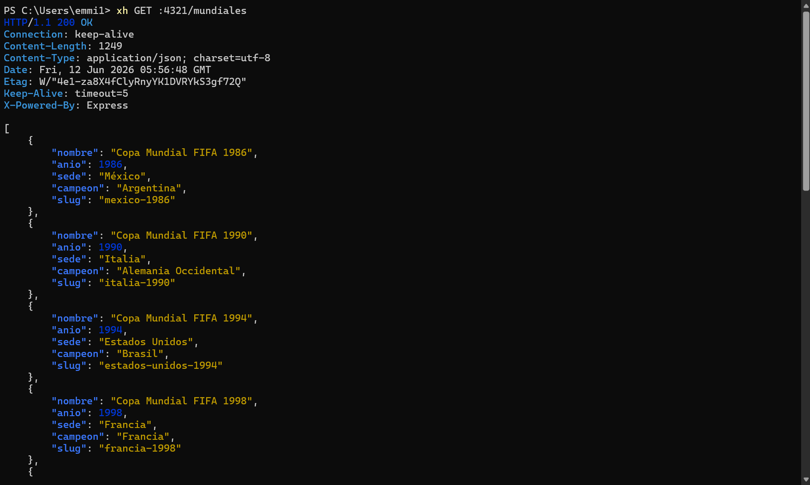
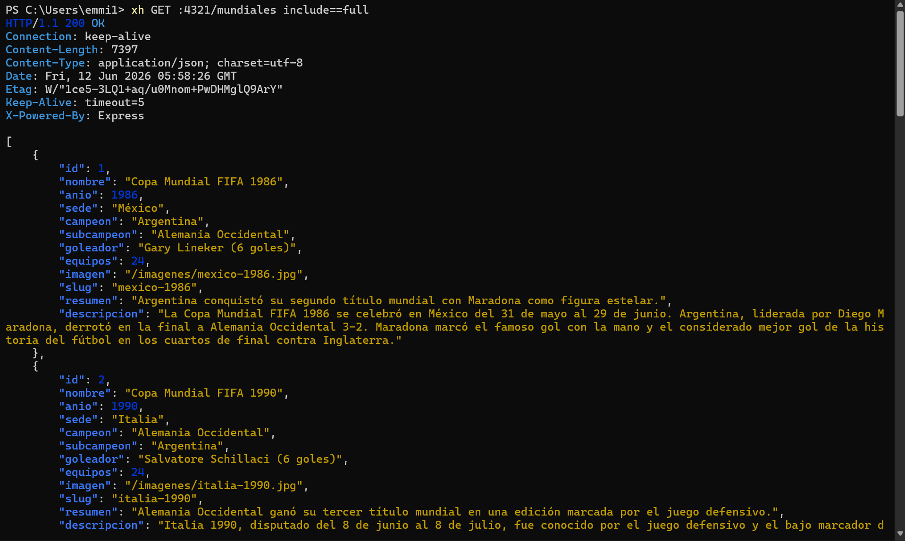
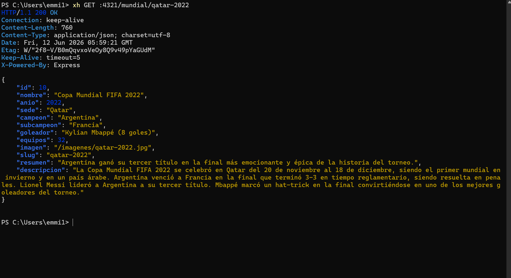
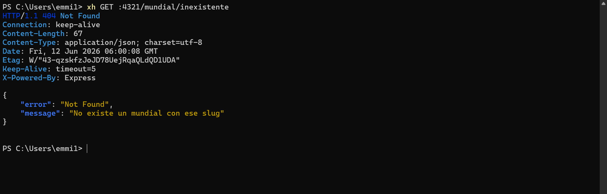
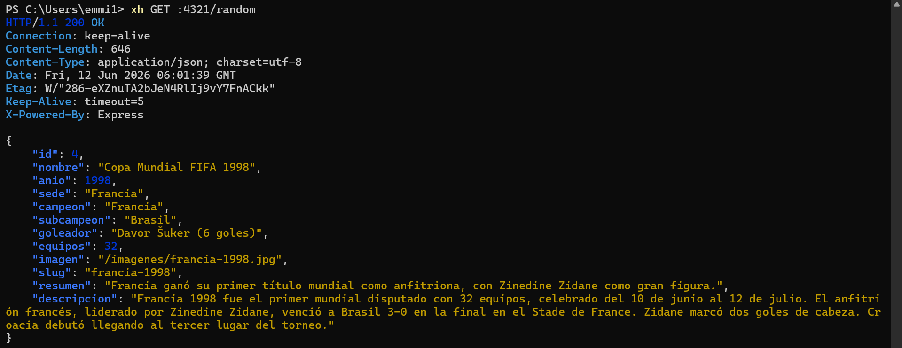
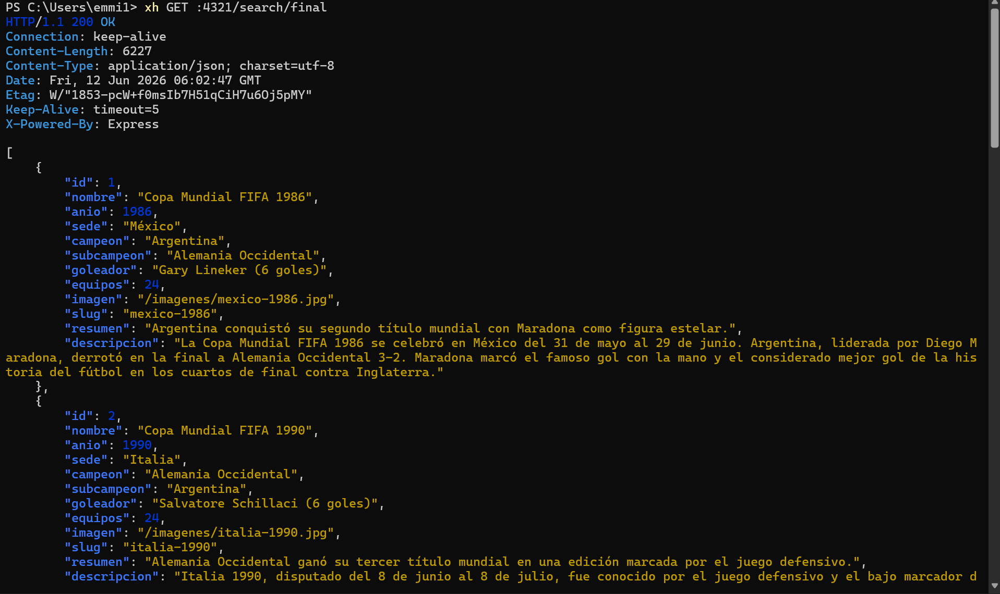
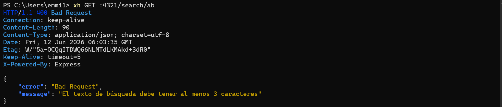
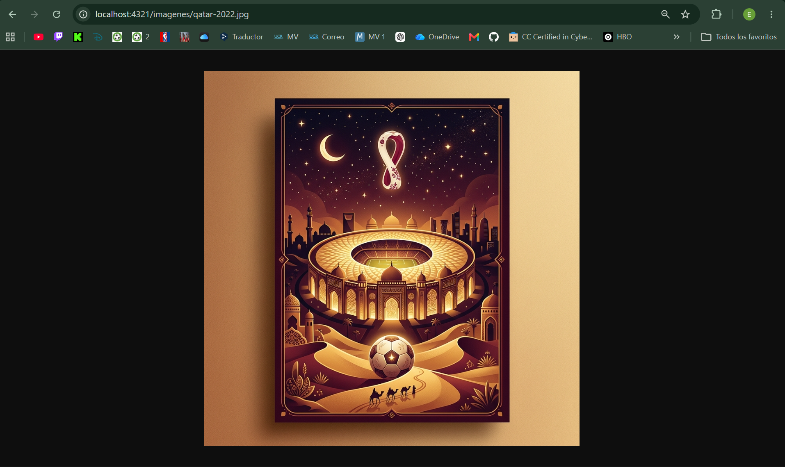

# Copa Mundial FIFA — API REST

API REST desarrollada con **Node.js**, **Express**, **SQLite** y **Zod** que expone información sobre distintas ediciones de la Copa Mundial FIFA.

El proyecto implementa persistencia en SQLite, validaciones con Zod y manejo correcto de códigos HTTP según los requerimientos del laboratorio.

---

## Tecnologías utilizadas

| Tecnología | Uso                           |
| ---------- | ----------------------------- |
| Node.js    | Entorno de ejecución          |
| Express    | Servidor HTTP                 |
| SQLite     | Persistencia de datos         |
| sqlite3    | Driver SQLite                 |
| Zod        | Validación de datos           |
| ES Modules | Sistema de módulos JavaScript |

---

## Instalación

Clonar el repositorio:

```bash
git clone https://github.com/LeBron01603/Tarea2-Multimedios.git
cd Tarea2-Multimedios
```

Instalar dependencias:

```bash
npm install
```

---

## Inicializar la base de datos

Ejecutar el script seed para crear la tabla e insertar los datos:

```bash
npm run seed
```

---

## Ejecutar el servidor

```bash
npm start
```

Servidor disponible en:

```txt
http://localhost:4321
```

---

## Estructura del proyecto

```txt
TAREA2--MULTIMEDIOS/
│
├── database/
│   ├── connection.js
│   ├── init.js
│   └── CREATE.SQL
│
├── data/
│   └── mundiales.json
│
├── public/
│   ├── imagenes/
│   └── capturas/
│
├── src/
│   ├── app.js
│   ├── controllers/
│   ├── routes/
│   ├── schemas/
│   └── middleware/
│
├── index.js
├── package.json
├── README.md
├── REFERENCIAS.md
└── .gitignore
```

---

## Rutas disponibles

| Método | Ruta                      | Descripción                 |
| ------ | ------------------------- | --------------------------- |
| GET    | `/`                       | Información de la API       |
| GET    | `/mundiales`              | Lista resumida de mundiales |
| GET    | `/mundiales?include=full` | Lista completa              |
| GET    | `/mundial/:slug`          | Mundial por slug            |
| GET    | `/campeon/:pais`          | Mundiales ganados por país  |
| GET    | `/random`                 | Mundial aleatorio           |
| GET    | `/search/:text`           | Búsqueda por texto          |
| GET    | `/imagenes/*`             | Imágenes estáticas          |

---

## Códigos HTTP implementados

| Código | Significado |
| ------ | ----------- |
| 200    | OK          |
| 400    | Bad Request |
| 404    | Not Found   |

---

## Mundiales incluidos

| Año  | Sede                            | Campeón             |
| ---- | ------------------------------- | ------------------- |
| 1986 | México                          | Argentina           |
| 1990 | Italia                          | Alemania Occidental |
| 1994 | Estados Unidos                  | Brasil              |
| 1998 | Francia                         | Francia             |
| 2002 | Corea del Sur y Japón           | Brasil              |
| 2006 | Alemania                        | Italia              |
| 2010 | Sudáfrica                       | España              |
| 2014 | Brasil                          | Alemania            |
| 2018 | Rusia                           | Francia             |
| 2022 | Qatar                           | Argentina           |
| 2026 | México, Estados Unidos y Canadá | Por definir         |

---

## Pruebas requeridas por el laboratorio

```bash
xh GET :4321/mundiales

xh GET :4321/mundiales include==full

xh GET :4321/mundial/qatar-2022

xh GET :4321/mundial/inexistente

xh GET :4321/campeon/Argentina

xh GET :4321/random

xh GET :4321/search/final

xh GET :4321/search/ab
```

---

# Evidencias de ejecución

## GET /mundiales



---

## GET /mundiales?include=full



---

## GET /mundial/qatar-2022



---

## GET /mundial/inexistente



---

## GET /campeon/Argentina


---

## GET /random



---

## GET /search/final



---

## GET /search/ab



---

## Prueba de imágenes

Accediendo directamente desde el navegador:

```txt
http://localhost:4321/imagenes/qatar-2022.jpg
```



---

## Cómo probar las imágenes

Ejemplos:

```txt
http://localhost:4321/imagenes/mexico-1986.jpg
http://localhost:4321/imagenes/qatar-2022.jpg
http://localhost:4321/imagenes/mundial-2026.jpg
```

Las imágenes son servidas mediante `express.static()` y no existe frontend ni vistas HTML.

---

## Cumplimiento del enunciado

* ✅ Node.js + Express
* ✅ SQLite
* ✅ Zod
* ✅ ES Modules
* ✅ Puerto 4321
* ✅ 11 mundiales registrados
* ✅ Imágenes accesibles por URL
* ✅ Manejo de códigos 200, 400 y 404
* ✅ README.md
* ✅ REFERENCIAS.md
* ✅ Persistencia SQLite
* ✅ Documentación de pruebas
* ✅ Estructura modular basada en lo visto en clase

---

## Autor

**Emiliano Martínez**
Curso: Multimedios
Universidad de Costa Rica
